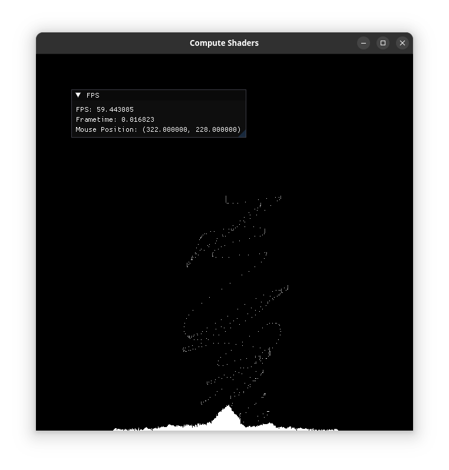
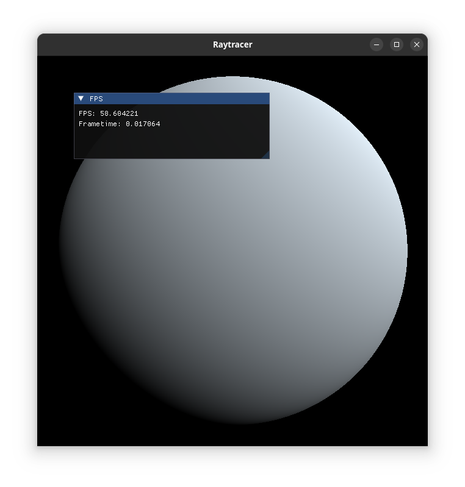
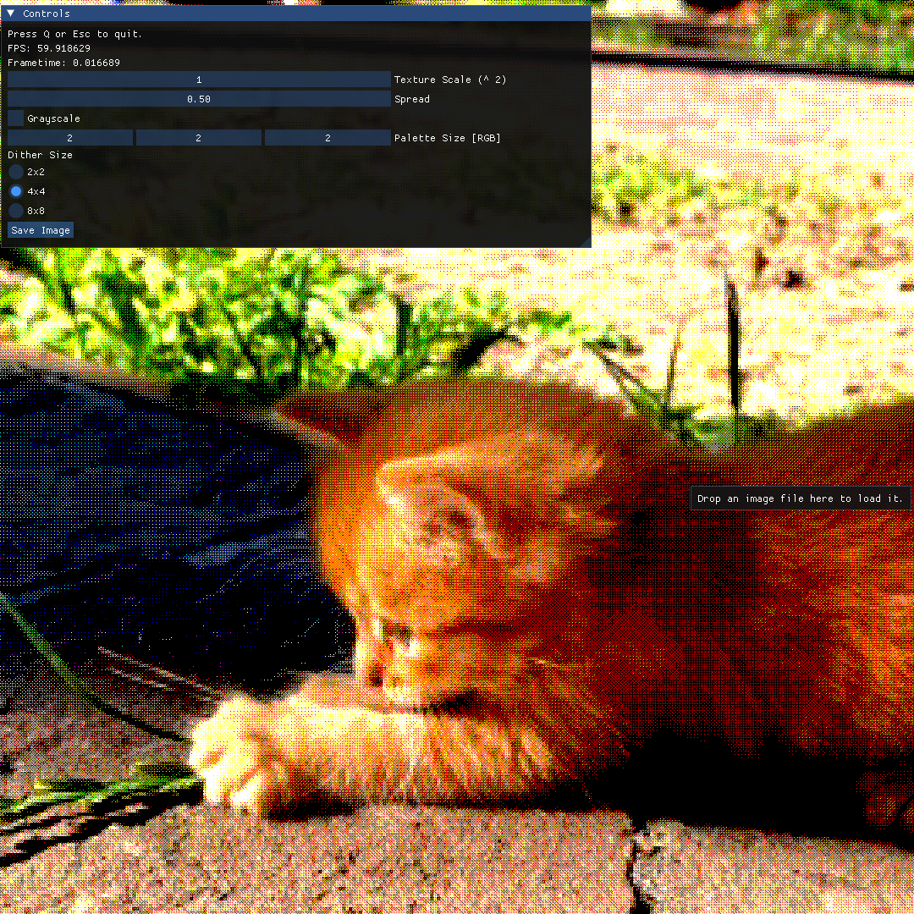

# Shaders

This repository contains a collection shader programs I made as a fun practice :)

## Programs list

### Falling Sand simulation

Learnt from [this video](https://youtu.be/8Tf18MMZ-5U) by [@Yusef28
](https://www.youtube.com/@Yusef28) and [this paper](https://arxiv.org/abs/2008.06341)

Run `cmake -DPROGRAMS=sand ..` to build



### Raytracer

Learnt from [this video](https://youtu.be/sVps_gqlrqQ) by [@GetIntoGameDev](https://www.youtube.com/@GetIntoGameDev).

Run `cmake -DPROGRAMS=raytracer ..` to build



### [Ordered Dithering](https://en.wikipedia.org/wiki/Ordered_dithering) (or Bayer Dithering)

Learnt (more like copied) from [this video](https://youtu.be/8wOUe32Pt-E) by [@Acerola](https://www.youtube.com/@Acerola_t).

Run `cmake -DPROGRAMS=dither ..` to build



> A random cute cat image from internet :>

## Building Instructions

- Recursively clone this repo

```bash
git clone --recursive https://github.com/mdhvg/shaders
cd shaders
```

- Create build directory

```bash
mkdir build
cd build
```

### Linux/MacOS (Mac not tested)

- Build a specific program

```bash
cmake -DPROGRAMS=prog1;prog2 ..
make -j4
```

- Or simply build all programs

```bash
cmake -DPROGRAMS=all ..
make -j4
```

```bash
cmake ..
make -j4
```

### Windows

Requirements: [MinGW-w64](https://www.mingw-w64.org/downloads/), [Ninja](https://ninja-build.org/)

- Build a specific program

```bash
cmake -G "Ninja" -DCMAKE_SYSTEM_NAME=Windows -DCMAKE_C_COMPILER=x86_64-w64-mingw32-gcc -DCMAKE_CXX_COMPILER=x86_64-w64-mingw32-g++ -DPROGRAMS=prog1;prog2 -B . -S ..
ninja
```

- Build all programs

```bash
cmake -G "Ninja" -DCMAKE_SYSTEM_NAME=Windows -DCMAKE_C_COMPILER=x86_64-w64-mingw32-gcc -DCMAKE_CXX_COMPILER=x86_64-w64-mingw32-g++ -B . -S ..
ninja
```
